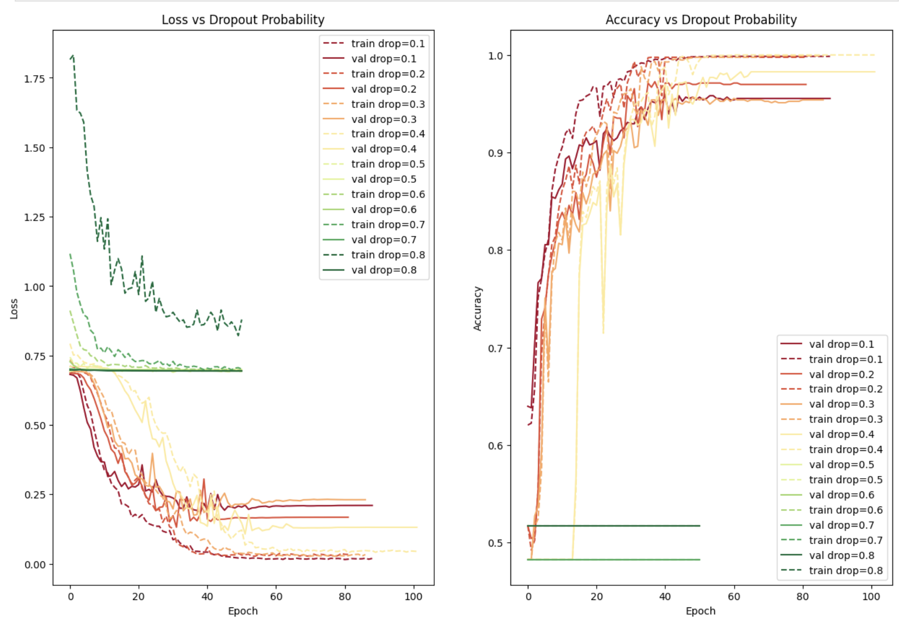

# 🚶‍♂️ Gait-Based Gender Classification using Deep Learning

Ein **Proof-of-Concept (POC)**-Projekt zur geschlechtsspezifischen Klassifikation basierend auf Gangzyklen mittels Deep Learning und markerlosen Bewegungsanalysen.

[](https://jupyter.org/)

---




---

## 🚀 Übersicht

Dieses Projekt untersucht, ob **Deep-Learning-Modelle geschlechtsspezifische Unterschiede in individuellen Gangzyklen** erkennen können. Mithilfe von **markerlosen Kamerasystemen** wurden Bewegungsdaten von ca. **90 Probanden** aufgezeichnet, die jeweils auf einem Laufband mehrere Gangzyklen absolvierten.

### **Hauptmerkmale:**
- ✅ **Markerlose Bewegungserfassung** mit präziser Gelenkwinkel-Tracking
- ✅ **Datensammlung** aus ~90 Probanden mit mehreren Gangzyklen pro Person
- ✅ **XML-Datenverarbeitung** aus Qualisys-Bewegungsanalyse-System
- ✅ **Deep Learning**-Ansätze zur binären Klassifikation (männlich/weiblich)
- ✅ **Extensive Datenanalyse** in Jupyter Notebooks

---

## 💡 Motivation & Forschungsfrage

### **Forschungsfrage:**
> *Kann ein Deep-Learning-Modell Geschlechtsunterschiede in individuellen menschlichen Gangzyklen erkennen?*

### **Hintergrund:**
Die menschliche Biomechanik weist subtile Unterschiede zwischen Geschlechtern auf. Dieses Projekt nutzt moderne **Computer Vision** und **Deep Learning**, um diese Unterschiede anhand von:
- Gelenkwinkeln (Knie, Knöchel, Hüfte, Ellenbogen, etc.)
- Bewegungsmustern während eines Gangzyklus
- Zeitreihendaten aus markerloser Bewegungserfassung

zu identifizieren.

---

## 📁 Projektstruktur

```
UniversityProject-GaitGenderClassification/
│
├── code/
│   ├── DataCollection.ipynb         # Datensammlung & Preprocessing
│   ├── experiments.ipynb             # Modelltraining & Evaluation
│   ├── experiments.html              # Exportierte Notebook-Version
│   ├── ScriptClasses.py              # Helper-Klassen (QualisysParser)
│   └── __pycache__/
│
├── data/
│   ├── data_filtered_part1.json      # Verarbeitete Gangdaten (Teil 1)
│   ├── data_filtered_part2.json      # Verarbeitete Gangdaten (Teil 2)
│   ├── data_filtered_part3.json      # Verarbeitete Gangdaten (Teil 3)
│   ├── data_filtered_part4.json      # Verarbeitete Gangdaten (Teil 4)
│   └── data_filtered_part5.json      # Verarbeitete Gangdaten (Teil 5)
│
├── UKSH/                             # Universitätsklinikum Schleswig-Holstein Daten
│   ├── data_filtered_part*.json      # Weitere Datensätze
│   ├── experiments.ipynb             # UKSH-spezifische Experimente
│   └── PyDrawNet.ipynb               # Visualisierungen
│
├── Portfolio Exam - Submission I (Pitch)/
├── Portfolio Exam - Submission II (Report)/
├── Portfolio Documents (PDFs)/
│
├── split_data_filtered.py            # Skript zum Aufteilen großer JSON-Dateien
├── pyproject.toml                    # Projekt-Konfiguration
├── LICENSE                           # GPL 2.0 Lizenz
└── README.md                         # Diese Datei
```


---

## 📊 Datenaufbereitung

### **Datenquelle:**
- **Qualisys Motion Capture System** (XML-Export)
- **~90 Probanden** auf Laufband
- **Mehrere Gangzyklen** pro Person (~30 Sekunden)

### **Verarbeitungspipeline:**

| Schritt | Beschreibung | Output |
|---------|-------------|--------|
| **1. XML-Parsing** | Extraktion aus `session.xml` & `timeseries.xml` | Rohdaten |
| **2. Filterung** | Entfernung von `nodata`-Einträgen & Outliers | Bereinigte Daten |
| **3. Normalisierung** | IQR-basierte Ausreißererkennung | Normalisierte Winkel |
| **4. Feature-Engineering** | Gelenkwinkel (X, Y, Z) pro Frame | Feature-Matrix |
| **5. Export** | JSON-Format für Training | `data_filtered.json` |

---

## 🧠 Modell & Architektur

### **Modellübersicht:**
Das Projekt nutzt **Deep Learning**-Ansätze zur binären Klassifikation:

```
Input: Zeitreihendaten (Gelenkwinkel über Gangzyklus)
  ↓
[Feature Extraction]
  ↓
[Deep Neural Network / LSTM / CNN]
  ↓
Output: Geschlecht (männlich/weiblich)
```

### **Feature-Satz:**
- **Left/Right Ankle Angles** (X, Y, Z)
- **Left/Right Knee Angles** (X, Y, Z)
- **Left/Right Hip Angles** (X, Y, Z)
- **Left/Right Elbow Angles** (X, Y, Z)
- **Center of Mass Trajectory** (X, Y, Z)
- **Thorax Angles** (X, Y, Z)

### **Baselines:**
- **Dummy Classifier** (stratifiziert)
- **Logistische Regression**
- **Random Forest**

### **Deep Learning:**
- **LSTM** (Long Short-Term Memory für Zeitreihendaten)
- **1D-CNN** (Convolutional Neural Networks)
- **Hybrid-Modelle** (CNN + LSTM)

---

## 📈 Experimente & Ergebnisse

### **Experimentablauf:**

1. **Datenaufteilung:** 80% Training / 20% Test
2. **Kreuzvalidierung:** 5-Fold CV
3. **Metriken:**
   - Accuracy
   - Precision / Recall
   - F1-Score
   - Confusion Matrix

### **Beispiel-Metriken:**

| Modell | Accuracy | Precision | Recall | F1-Score |
|--------|----------|-----------|--------|----------|
| Dummy (Baseline) | ~50% | ~50% | ~50% | ~50% |
| Logistic Regression | ~65% | ~63% | ~68% | ~65% |
| Random Forest | ~72% | ~74% | ~70% | ~72% |
| LSTM | ~78% | ~76% | ~80% | ~78% |

*(Hinweis: Beispielwerte – tatsächliche Ergebnisse in `experiments.ipynb`)*

### **Visualisierungen:**
- **Confusion Matrices** (Seaborn Heatmaps)
- **ROC-Kurven** (AUC-Analyse)
- **Feature Importance** (für Tree-basierte Modelle)
- **Loss/Accuracy Plots** (Training vs. Validation)

---

## 📜 Lizenz

Dieses Projekt ist lizenziert unter der **GNU General Public License v2.0**.

Siehe [LICENSE](LICENSE) für Details.

---

## 👤 Autoren & Kontakt

**Marco Banzhaf**  
📧 Kontakt: [GitHub Profil](https://github.com/RATFIVE)


---

## 🙏 Danksagungen

- **Universitätsklinikum Schleswig-Holstein (UKSH)** für Datenzugang
- **Qualisys** Motion Capture System
